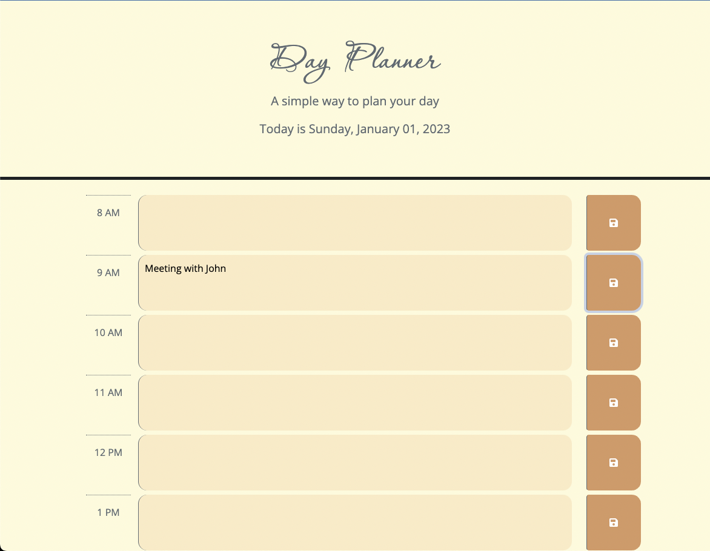

# Dynamic Dayplanner

## Description

This day planner was an assignment from coding bootcamp. 

The user can plan their workday by inputting their daily tasks into the time slots and saving them to view later. 

## Installation

This web app runs on most browsers. You can visit the deployed link here: https://steviemiller.github.io/dynamic-dayplanner/

## Screenshots
